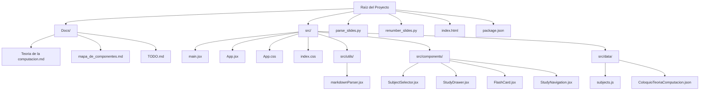
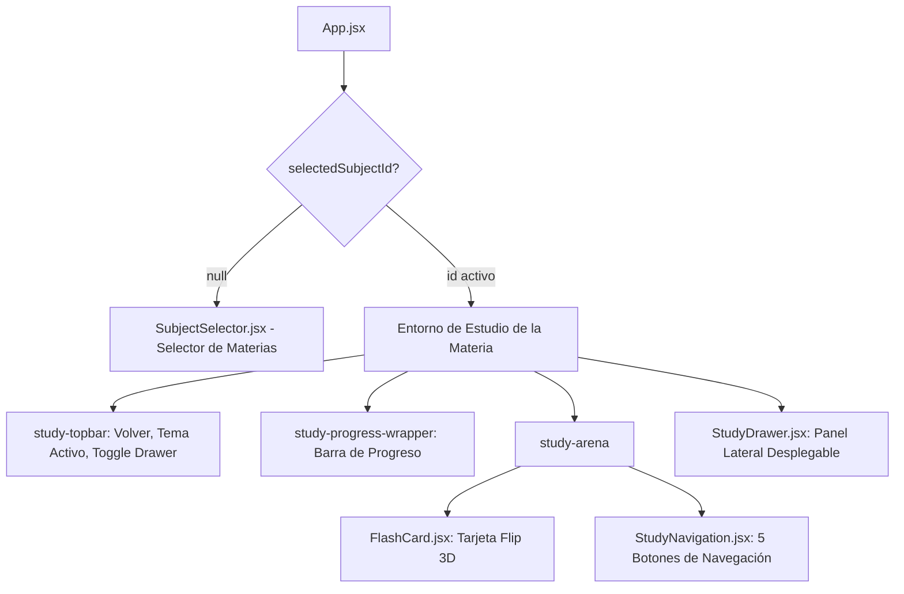

# Mapa de Componentes y Vistas de MemoCard

Este documento detalla la estructura y arquitectura modular del proyecto **MemoCard**, asignando nombres a cada componente, vista, variable de estado, función de utilidad y bloque de estilos CSS.

---

## 📂 Mapa de Archivos del Proyecto

El proyecto está estructurado como una Single Page Application (SPA) React 19 con Vite, modularizada bajo principios SOLID:

- **[index.html](../index.html)**: Punto de entrada HTML. Monta `src/main.jsx`.
- **[src/main.jsx](../src/main.jsx)**: Montaje de la raíz React con `<App />`.
- **[src/App.jsx](../src/App.jsx)**: Orquestador principal de estado global (materia activa, índice de tarjeta, apertura de drawer y persistencia).
- **[src/data/subjects.js](../src/data/subjects.js)**: Catálogo extensible de materias disponibles para estudio.
- **[src/types/cardTypes.js](../src/types/cardTypes.js)**: Tipado base, tipos de tarjeta polimórficos (`basic`, `cloze`, `input`, `image_occlusion`), metadatos de subtema, tags y secuencia de derivación.
- **[src/utils/clozeParser.js](../src/utils/clozeParser.js)**: Parser regex y AST de sintaxis Anki (`{{c1::texto::pista}}`), soporte de clozes múltiples idénticos (revelación conjunta) y disjuntos (generación de sub-tarjetas `expandClozeCards`).
- **[src/utils/mediaResolver.js](../src/utils/mediaResolver.js)**: Resuelve rutas de imágenes, audio, video y diagramas locales/remotos.
- **[src/utils/answerValidator.js](../src/utils/answerValidator.js)**: Motor de normalización de respuestas (tildes, espacios, mayúsculas) y evaluación multi-variante con distancia de Levenshtein para tarjetas con input.
- **[src/utils/characterDiff.js](../src/utils/characterDiff.js)**: Algoritmo de alineación LCS para diff de caracteres estilo Anki (verdes correctos, rojos tachados y faltantes).
- **[src/utils/markdownParser.jsx](../src/utils/markdownParser.jsx)**: Utilidades desacopladas de renderizado KaTeX y Markdown (`renderSlideLines`, `renderTextWithMathAndMarkdown`, `parseMarkdownText`).
- **[src/components/SubjectSelector.jsx](../src/components/SubjectSelector.jsx)**: Vista inicial para seleccionar la materia de estudio.
- **[src/components/FlashCard.jsx](../src/components/FlashCard.jsx)**: Tarjeta interactiva con giro 3D, soporte multimedia (`CardMedia`), badges de subtema y secuencia de derivación por pasos (`Paso X de Y`), e insignias de tags transversales.
- **[src/components/ClozeText.jsx](../src/components/ClozeText.jsx)**: Renderizador interactivo de texto con clozes mediante píldoras censuradas interactivas, alternancia de visibilidad individual y soporte matemático KaTeX.
- **[src/components/TypeAnswerBox.jsx](../src/components/TypeAnswerBox.jsx)**: Módulo de entrada de texto interactivo con aislamiento de atajos de teclado, validación en tiempo real, desglose visual de diff y degradación a modo pasivo.
- **[src/components/ImageOcclusion.jsx](../src/components/ImageOcclusion.jsx)**: Módulo de oclusión de imágenes para esquemas y anatomía con overlay SVG responsivo, coordenadas porcentuales y alternancia individual de máscaras.
- **[src/components/CardMedia.jsx](../src/components/CardMedia.jsx)**: Renderizado de recursos multimedia con modal lightbox de alta resolución, toolbar de control, zoom interactivo (1x a 4x), desplazamiento pan mediante arrastre GPU y atajos de teclado.
- **[src/components/StudyNavigation.jsx](../src/components/StudyNavigation.jsx)**: Panel de control con los 5 botones requeridos y atajos globales (`A`/`D` para tarjetas, `Shift+A`/`Shift+D` para temas, `R` para tema aleatorio y `Espacio` para revelación/flip).
- **[src/components/StudyDrawer.jsx](../src/components/StudyDrawer.jsx)**: Drawer lateral con acordeón temático, barra de filtro transversal por tags (`#definicion`, `#examen`), insignias de subtema y secuencias de derivación.
- **[src/App.css](../src/App.css)**: Estilos de componentes, layout, microinteracciones, tags y efectos 3D.
- **[src/index.css](../src/index.css)**: Variables de diseño, tema oscuro y estilos globales.

---

## 🗺️ Flujo de Navegación y Vistas

### 1. Vista Selección de Materias (`SubjectSelector.jsx`)
- Se presenta al ingresar si no hay materia seleccionada.
- Muestra el grid de materias disponibles (`.subjects-grid`) con estadísticas clave: temas disponibles, cantidad de tarjetas y botón de acceso.
- Al seleccionar una materia, establece `selectedSubjectId` en el estado y en `localStorage`.

### 2. Entorno de Estudio de la Materia
- **Barra Superior (`.study-topbar`)**:
  - Botón *← Materias* para volver al selector.
  - Indicador de la materia y pastilla del tema temático activo (`.active-theme-pill`).
  - Botón conmutador de tema (`.btn-contrast-toggle`): alternancia entre tema oscuro estándar y *Alto Contraste* (negro absoluto OLED, fórmulas KaTeX de alta nitidez e inversión selectiva de diagramas).
  - Botón selector de modo (`.btn-mode-toggle`): alternancia entre *⚡ Interactivo* (revelación progresiva y clozes clickeables) y *📖 Clásico* (degradación pasiva directa).
  - Botón *☰ Temas y Cards* con contador `X/N` para abrir/cerrar el drawer.
- **Barra de Progreso (`.study-progress-wrapper`)**:
  - Barra animada que refleja el porcentaje recorrido dentro del mazo.
- **Tarjeta Interactiva 3D (`FlashCard.jsx`)**:
  - Cara frontal: concepto, número de diapositiva y tema.
  - Clic o tecla `Espacio`: gira 180° y revela el dorso con definiciones, listas y fórmulas KaTeX.
- **Panel de Navegación (`StudyNavigation.jsx`)**:
  1. **⏮️ Tema Anterior**: Salta a la primera tarjeta del tema anterior.
  2. **◀️ Anterior**: Retrocede a la tarjeta previa (`currentIndex - 1`).
  3. **Siguiente ▶️**: Avanza a la siguiente tarjeta (`currentIndex + 1`).
  4. **Tema Siguiente ⏭️**: Salta a la primera tarjeta del tema siguiente.
  5. **🔀 Tema Aleatorio**: Salta a la primera tarjeta de un tema seleccionado al azar.
- **Drawer Temático (`StudyDrawer.jsx`)**:
  - Panel lateral deslizante con lista completa de tarjetas agrupadas por tema.
  - Permite colapsar/expandir temas individuales.
  - Tarjeta activa resaltada con auto-scroll a su posición.
