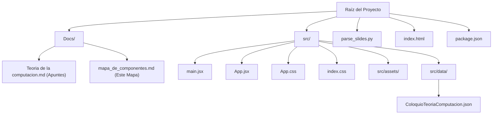
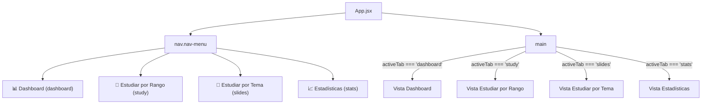

# Mapa de Componentes y Vistas de MemoCard

Este documento detalla la estructura del proyecto **MemoCard**, asignando nombres a cada componente, vista, variable de estado, función de utilidad y bloque de estilos CSS. Esto te permitirá señalar con precisión qué elementos modificar o eliminar.

---

## 📂 Mapa de Archivos del Proyecto

El proyecto está estructurado como una Single Page Application (SPA) React con Vite:

- **[index.html](../index.html)**: Punto de entrada HTML. Carga `src/main.jsx`.
- **[src/main.jsx](../src/main.jsx)**: Punto de montaje de React. Renderiza el componente `<App />`.
- **[src/App.jsx](../src/App.jsx)**: Componente principal y contenedor de toda la lógica de la aplicación.
- **[src/App.css](../src/App.css)**: Estilos específicos de componentes y secciones de la aplicación.
- **[src/index.css](../src/index.css)**: Estilos globales, variables de color CSS, tipografía y animaciones generales.
- **[src/data/ColoquioTeoriaComputacion.json](../src/data/ColoquioTeoriaComputacion.json)**: JSON autogenerado que contiene las diapositivas y tarjetas de estudio.
- **[parse_slides.py](../parse_slides.py)**: Script en Python para convertir los apuntes de markdown en el JSON de datos.

---

## 🗺️ Mapa de Vistas y Pestañas (Layout Principal)

La navegación principal (`nav-menu`) alterna el estado `activeTab` para renderizar condicionalmente una de las siguientes cuatro vistas en el contenedor `main`:

### 1. Vista Dashboard (`activeTab === 'dashboard'`)
Punto de inicio donde se ve un resumen rápido y se lanzan las sesiones de estudio.
*   **Grid de Estadísticas Rápidas (`.dashboard-grid`)**: Muestra 4 tarjetas de estadísticas (`.stat-card`):
    1.  *Diapositivas*: Cantidad total de diapositivas en los apuntes.
    2.  *Tarjetas Totales*: Cantidad de conceptos extraídos.
    3.  *Aprendidas*: % y cantidad de tarjetas vistas por lo menos una vez.
    4.  *Dominadas*: % y cantidad de tarjetas con estado "Bien" o "Fácil".
*   **Lanzador de Sesión Rápida (`.action-box`)**:
    *   Botón *Estudiar Todo* (`startStudy('all')`).
    *   Botón *Repasar Débiles* (`startStudy('weak')`) (solo visible si hay tarjetas calificadas como *Otra vez* o *Difícil*).
    *   Botón *Estudiar Pendientes* (`startStudy('pending')`) (solo visible si quedan tarjetas por aprender).
*   **Panel de Configuración de Estudio Personalizado (`.glass-panel`)**:
    *   Filtro de Rango de Diapositivas (Inputs para `filterSlideStart` y `filterSlideEnd`).
    *   Dropdown de Estado (Selector para `filterStatus`: todas, no estudiadas, errores/difíciles, dominadas).
    *   Checkbox de Mezcla Aleatoria (Toggle para `shuffleCustom`).
    *   Botón *Iniciar Personalizado* (`startStudy('custom')`).

### 2. Vista Estudiar por Rango (`activeTab === 'study'`)
Interfaz interactiva de repetición espaciada con tarjetas en 3D para un intervalo de diapositivas personalizado (por defecto, todas).
*   Llama al helper de renderizado interactivo `renderStudySession(studySession, setStudySession, handleGradeCard, handlePrevCard, handleNextCard, exitCallback)` para dibujar la sesión de estudio.

### 3. Vista Estudiar por Tema (`activeTab === 'slides'`)
Interfaz interactiva para estudiar temas específicos del coloquio con rangos predefinidos de diapositivas.
*   **Grid de Temas (`.themes-grid`)**: Muestra los 4 temas dinámicamente ("Alfabetos y Cadenas", "Lenguajes en general", "Lenguajes Regulares y Expresiones Regulares", "Gramática") en tarjetas estilizadas (`.theme-card`). Cada tarjeta despliega:
    *   El rango exacto de diapositivas y conteo de páginas.
    *   El porcentaje acumulado de dominio (tarjetas en estado Bien/Fácil).
    *   Una barra de progreso visual de dominio.
*   **Flujo de Sesión Activa**: Al seleccionar un tema, inicializa `themeStudySession` llamando a `startThemeStudy(themeName)`. Utiliza el helper genérico `renderStudySession` para proveer la misma interfaz interactiva 3D que el estudio de rango. Al hacer clic en "Salir", el usuario regresa al listado de temas.

### 4. Vista Estadísticas (`activeTab === 'stats'`)
Informes y resumen visual detallado del estado del aprendizaje de las tarjetas.
*   **Resumen de Progreso (`.progress-summary`)**: Muestra métricas detalladas y una barra horizontal segmentada con colores (`.summary-bar-wrapper` y `.bar-segment` de cada tipo: easy, good, hard, again, unlearned).
*   **Cuadrícula de Leyendas (`.legend-grid`)**: Desglosa la cantidad de tarjetas y el porcentaje exacto en cada uno de los 5 estados (Fácil, Bien, Difícil, Repasar, Pendiente).
*   **Sección de Reseteo**: Botón "Restablecer Progreso" (`.btn-secondary` con emoji 🗑️) para borrar el historial de `localStorage`.

---

## 🛠️ Lógica Interna y Funciones en `App.jsx`

Las siguientes funciones controlan el renderizado de LaTeX, Markdown, Cloze Test y la lógica de flujo:

### Funciones de Formateo y Renderizado (Fuera de `App()`)
1.  **`parseMarkdownText(segment, isClozeMode, keyPrefix)`**:
    *   Usa expresiones regulares para detectar texto con estilo Markdown: `***negrita itálica***`, `**negrita**` y `*itálica*`.
    *   Si `isClozeMode` es `true`, reemplaza las partes en negrita/itálica por un span interactivo de clase `.cloze-concept.blurred` para que se revelen al hacer clic.
2.  **`restoreMathPlaceholders(nodes, mathItems)`**:
    *   Función recursiva que busca marcadores temporales de LaTeX (`%%BLOCKMATH_i%%`, `%%INLINEMATH_i%%`) y los reemplaza por los elementos JSX renderizados previamente con KaTeX.
3.  **`renderTextWithMathAndMarkdown(text, isClozeMode, keyPrefix)`**:
    *   Parsea un bloque de texto completo. Primero extrae las ecuaciones KaTeX en bloque (`$$...$$`) y en línea (`$...$`), reemplazándolas por marcadores temporales.
    *   Luego pasa el texto plano a `parseMarkdownText` y finalmente restaura el LaTeX con `restoreMathPlaceholders`.
    *   Detecta si el texto comienza con `>` para darle estilo de nota al pie (`.card-footnote`).
4.  **`renderMathAndMarkdown(text)`**:
    *   Instancia rápida de la función anterior sin modo cloze.
5.  **`renderSlideLines(content)`**:
    *   Divide el contenido de una diapositiva en líneas.
    *   Detecta listas ordenadas (`ol`) y desordenadas (`ul`), sangrías, ecuaciones solitarias en bloque (`$$...$$`) y bloques de nota (`&gt;`).
    *   Agrupa los elementos de la lista consecutiva y renderiza todo estructuradamente aplicando `renderTextWithMathAndMarkdown`.

### Métodos del Componente Principal `App()`
*   **`saveProgress(updatedCards)`**: Guarda en `localStorage` (clave `memocard_progress`) el estado de estudio mapeado únicamente para las tarjetas modificadas.
*   **`handleGradeCard(status)`**: Asigna una calificación a la tarjeta actual (`again`, `hard`, `good`, `easy`) en la sesión personalizada, la guarda llamando a `saveProgress` y avanza el índice.
*   **`handleThemeGradeCard(status)`**: Realiza la misma calificación pero sobre la sesión del tema seleccionado (`themeStudySession`).
*   **`startStudy(mode)`**: Filtra las tarjetas según el modo deseado (`all`, `weak`, `pending`, `range` o `custom`). Si la cola no está vacía, la ordena o mezcla y asigna el estado `studySession`.
*   **`startThemeStudy(themeName)`**: Filtra las tarjetas pertenecientes al tema seleccionado, las ordena por orden correlativo e inicia la sesión `themeStudySession`.
*   **`resetProgress()`**: Limpia la clave de `localStorage` y restablece el estado de todas las tarjetas a `unlearned`.
*   **`renderStudySession(session, setSession, onGrade, onPrev, onNext, onExit)`**: Renderiza el visor interactivo de memorización 3D (barra de progreso, tarjeta flip 3D con KaTeX, y botones de evaluación rápidos) reutilizado en ambas pestañas.
*   **Atajos de Teclado (dentro de un `useEffect`)**:
    *   `Space`: Si la respuesta está oculta, la revela. Si ya está revelada, califica como "Bien" (`good`).
    *   `A` / `ArrowLeft`: Va a la tarjeta anterior.
    *   `D` / `ArrowRight`: Va a la tarjeta siguiente.
    *   Teclas `1`, `2`, `3`, `4`: Califican la tarjeta con *Otra vez*, *Difícil*, *Bien* o *Fácil* respectivamente si la respuesta está visible. Funciona tanto para el estudio por rango como por temas.

---

## 🎨 Mapa de Clases CSS (`App.css`)

Cuando edites estilos, ten en cuenta este mapa de selectores para no romper otras secciones:

### Estilos Generales de Contenedores y Menú
*   `.app-container`: Envuelve toda la aplicación, proporcionando padding y alineación central.
*   `.app-header`: Cabecera principal con degradados de texto en el título.
*   `.nav-menu` & `.nav-button`: El menú horizontal superior y sus botones con efectos hover y activos (`.nav-button.active` tiene fondo degradado).

### Estilos del Dashboard
*   `.dashboard-grid` & `.stat-card`: Rejilla responsiva y tarjetas de métricas.
*   `.action-box`: Contenedor principal de bienvenida y llamada a la acción de estudio.
*   `.btn-primary`: Botón principal con sombra difuminada y degradado.

### Estilos de Tarjetas (Memorización y Temas Activos)
*   `.study-container`: Contenedor centralizado para la sesión de tarjetas.
*   `.progress-track` & `.progress-bar`: Indicador de avance de la sesión actual.
*   `.card-perspective` & `.card-rotator`: Configuraciones 3D para permitir el giro de la tarjeta.
*   `.card-face` (`.front` / `.back`): Caras individuales de la tarjeta con fondos translúcidos (Glassmorphism).
*   `.card-term` & `.card-answer`: Tamaños de fuente y márgenes para el concepto (frente) y la respuesta (dorso).
*   `.card-context` & `.card-footnote`: Estilos de texto complementario y citas en cursiva.
*   `.flip-prompt`: Botón grande interactivo para voltear la tarjeta.
*   `.grade-controls` & `.grade-btn` (`.again`, `.hard`, `.good`, `.easy`): Botones inferiores con sus respectivos atajos de teclado visuales (`.shortcut`).

### Estilos de Grid de Temas
*   `.themes-grid-container`, `.themes-grid` & `.theme-card`: Contenedor, grid responsivo y tarjetas del menú de selección de temas.

### Estilos de Estadísticas
*   `.stats-panel`: Panel de resumen de progreso acumulado.
*   `.summary-bar-wrapper` & `.bar-segment` (`.easy`, `.good`, `.hard`, `.again`, `.unlearned`): Barra segmentada multicolor que muestra la proporción del aprendizaje.
*   `.legend-grid` & `.legend-item`: Leyendas explicativas con colores e indicadores de porcentaje de dominio.

---

## 🎯 Política de Eliminación Limpia y Código Cero Basura

Cuando se solicite eliminar una vista, pestaña o componente, se debe seguir estrictamente este procedimiento de limpieza para evitar archivos huérfanos y líneas residuales:

1.  **Eliminación del Markup JSX**: Remover el fragmento de código HTML/JSX que dibuja el componente en `App.jsx`.
2.  **Eliminación del Estado**: Rastrear y borrar todos los hooks `useState`, `useEffect`, `useCallback` o `useRef` que se utilizaban únicamente para ese componente.
3.  **Eliminación de Métodos**: Borrar funciones de soporte, manejadores de eventos o formateadores que dependieran exclusivamente del elemento borrado.
4.  **Limpieza de Hojas de Estilo (`App.css` e `index.css`)**: Buscar y borrar todas las clases CSS que correspondieran en exclusividad al componente eliminado.
5.  **Revisión de Dependencias e Imports**: Quitar del inicio de `App.jsx` cualquier import de paquete (ej. KaTeX o librerías) o de recursos estáticos que ya no se necesiten a raíz del borrado.
